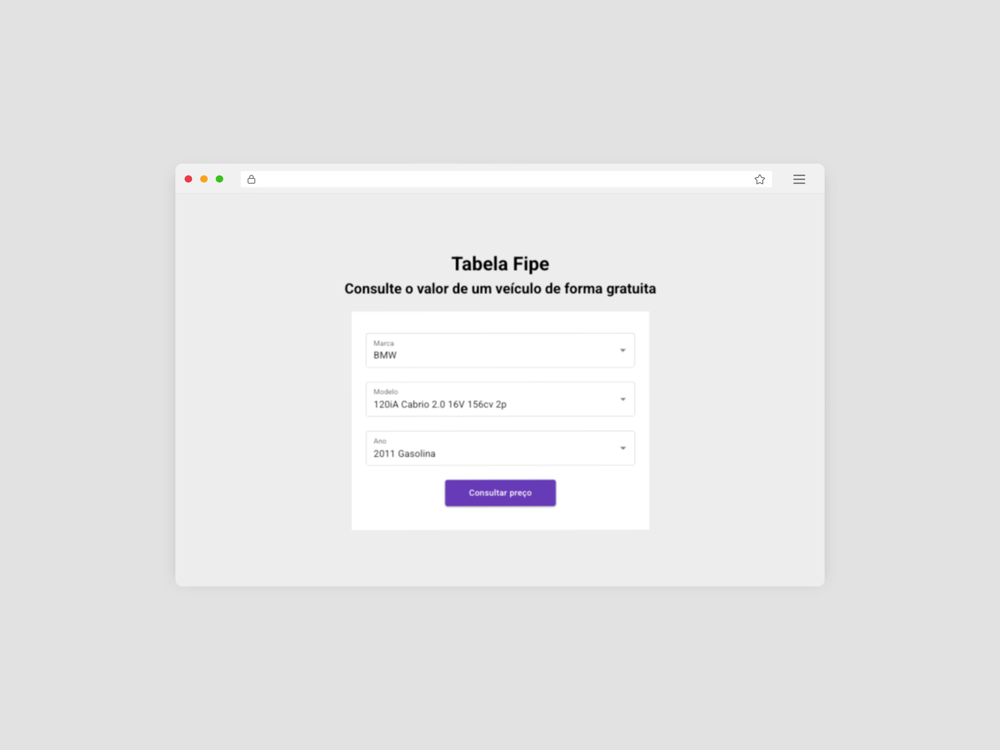

# Consulta de Preços de Veículos - Mobiauto Challenge



## Sobre o projeto

Acesse o projeto em: [Mobiauto Challenge](https://challenge-mobi.vercel.app/)

Esta aplicação oferece uma maneira fácil de verificar o preço de mercado de veículos no Brasil usando a API da Tabela FIPE. Os usuários podem selecionar a marca, modelo e ano do veículo para obter o preço atual de acordo com a FIPE.

## Exercicios

Este repositório também conta com um diretório em sua raiz chamado "exercises", onde são numerados de 01 a 04 que foram propostos junto ao desenvolvimento da aplicação.

## Tecnologias Utilizadas

- **Frontend**: React (Vite), Redux, Material UI e Styled Components
- **Roteamento**: React Router
- **Gerenciamento de Estado**: Redux Toolkit
- **Integração com API**: RTK Query
- **Testes**: Cypress
- **Estilização**: Styled Components, Material UI

## API

Este projeto utiliza a API gratuita da Tabela FIPE:
- URL Base: `https://parallelum.com.br/fipe/api/v1/`
- Endpoints:
  - Obter Marcas: `/carros/marcas`
  - Obter Modelos: `/carros/marcas/{codigoMarca}/modelos`
  - Obter Anos: `/carros/marcas/{codigoMarca}/modelos/{codigoModelo}/anos`
  - Obter Preço: `/carros/marcas/{codigoMarca}/modelos/{codigoModelo}/anos/{codigoAno}`

## Como Começar

### Pré-requisitos

- Node.js (versão 18 ou superior)
- npm

### Instalação

1. Clone o repositório
   ```bash
   git clone https://github.com/seuusuario/consulta-precos-veiculos.git
   cd consulta-precos-veiculos
   ```

2. Instale as dependências
   ```bash
   npm install
   ```

3. Inicie o servidor de desenvolvimento
   ```bash
   npm run dev
   ```

4. Abra seu navegador e acesse `http://localhost:5173` (ou a porta mostrada em seu terminal)

## Testes

Este projeto inclui testes com Cypress para os principais fluxos do usuário.

### Executando os Testes

```bash
# Abrir o Cypress Test Runner
npm run cypress:open

# Executar testes em modo headless
npm run cypress:run
```

### Cobertura de Testes

- Testes de integração com a API
- Testes de fluxo do usuário (marca -> modelo -> ano -> busca -> resultado)
